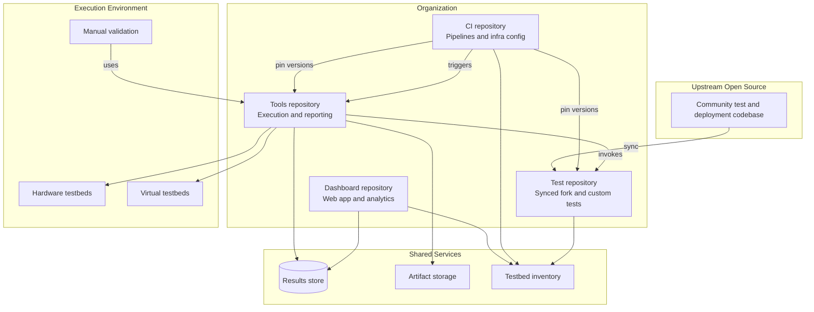

# SONiC Validation Organization — Abstract Repository Architecture

This document describes a four-repository model for validating SONiC on hardware and virtual testbeds, using community test frameworks, custom automation, CI, and manual end-to-end validation. It is intended for developers, test engineers, and management.

---

## 1. Purpose of the Split

SONiC validation spans several concerns that change at different rates and are owned by different teams:

- **Test content** — what to verify and how to interact with devices
- **Execution tooling** — how to run suites, collect artifacts, and publish results
- **Orchestration** — when and where runs happen, credentials, scheduling
- **Visibility** — reports, trends, device and testbed status

Keeping these in separate repositories reduces coupling, avoids duplicating runner logic between CI and manual workflows, and makes upstream synchronization manageable.

---

## 2. High-Level Architecture

---

## 3. The Four Repositories

### 3.1 Test Repository (Synced Fork + Custom Tests)

**Role:** Source of truth for *what* is tested and *how tests interact with SONiC testbeds*.

**Contains:**

- Automated test cases (community framework tests and organization-specific tests)
- Shared test infrastructure: fixtures, plugins, helpers, markers, skip conditions
- Testbed deployment and device interaction logic used during tests
- Test plans and technical documentation for validation scope
- Definitions that describe testbed topology and device roles (without secrets)

**Does not contain:**

- CI pipeline definitions
- Generic test runners used by both automation and manual workflows
- Web UI or reporting frontends
- Credentials or environment-specific secrets

**Relationship to upstream:**

- Maintained as a fork or mirror of the community project
- Periodically synchronized via merge or cherry-pick
- Organization-specific tests live in clearly separated areas so upstream merges stay predictable
- Long-lived stabilization branches may exist for specific product or SONiC release lines

**Primary consumers:** Test developers, feature developers contributing test fixes, release owners reviewing coverage.

---

### 3.2 Tools Repository (Execution, Suites, Reporting)

**Role:** Single execution layer for both automated CI runs and manual validation.

**Contains:**

- Logical test suite definitions (smoke, nightly, regression, release gate, and similar)
- Testbed profiles that map abstract testbed names to inventory the test repository expects
- Runners that invoke the test repository's frameworks with consistent parameters
- Pre- and post-run actions (deploy, sanity checks, log collection, artifact packaging)
- Result processing (parse standardized test output, enrich with run metadata, publish to backend systems)
- Manual E2E support (checklists, session recording, structured pass/fail capture)

**Does not contain:**

- Individual test assertions or feature-specific test logic
- Jenkins or other CI pipeline code
- Dashboard UI

**Key design rule:** CI and manual testers call the same tools. Pipelines should orchestrate; they should not reimplement how tests are launched.

**Primary consumers:** Test operations, automation engineers, manual testers, CI system (indirectly).

---

### 3.3 CI Repository (Pipelines and Infrastructure Automation)

**Role:** Defines *when*, *on which infrastructure*, and *under which constraints* validation runs.

**Contains:**

- Pipeline definitions and shared pipeline libraries
- Job parameters (suite name, testbed pool, image version, test repository revision)
- Agent or worker configuration and capability labels
- Testbed pool assignment and locking or reservation logic
- Integration with build systems, artifact registries, and notification channels
- References to secrets (not the secrets themselves)
- Operational jobs: testbed recovery, scheduled upstream sync, image validation triggers
- Documentation of the pipeline catalog for non-technical stakeholders

**Does not contain:**

- Test cases or test assertions
- Dashboard application code
- Duplicated test execution scripts (those belong in the tools repository)

**Key design rule:** A pipeline prepares the environment, invokes the tools repository, archives outputs, and triggers notifications. All test execution semantics live downstream in the tools and test repositories.

**Primary consumers:** DevOps and platform engineers, test leads defining gates, release managers tracking scheduled runs.

---

### 3.4 Dashboard Repository (Reports, Devices, Analytics)

**Role:** Read-mostly visibility into validation outcomes, lab state, and release readiness.

**Contains:**

- Web application and APIs
- Views for test runs, individual test case history, and flaky-test trends
- Testbed and device inventory presentation
- Manual validation session records
- Release or milestone readiness summaries
- Data ingestion endpoints (authenticated writes from tools and CI)
- Documentation of the information model and API contracts

**Does not contain:**

- Test execution logic
- Pipeline definitions
- Test source code

**Key design rule:** Test runs must succeed or fail independently of the dashboard. The dashboard observes outcomes; it does not control execution.

**Primary consumers:** Management, triage engineers, lab administrators, developers investigating failures.

---

## 4. Dependencies Between Repositories

| From | To | Dependency type |
|------|----|-----------------|
| Test repository | Upstream community project | Periodic sync; upstream is authoritative for shared tests and core infrastructure |
| Tools repository | Test repository | Runtime checkout at pinned branch or commit; invokes its test and deployment content |
| CI repository | Tools repository | Every run uses tools as the execution entry point |
| CI repository | Test repository | Indirect — revision passed through tools, not cloned separately by CI in most cases |
| Dashboard | Tools and CI | Ingests run metadata and results pushed after execution |
| Dashboard | Shared services | Reads results store, artifact links, inventory |
| All execution paths | Shared services | Artifact storage, credentials vault, testbed inventory |

**Version pinning:** For each product or SONiC release line, the organization should maintain an explicit compatibility matrix linking test repository revision, tools version, default suites, and expected image builds. CI parameters and suite definitions should reference this matrix rather than ad hoc floating versions.

---

## 5. Data and Control Flows

### Automated regression (CI)

1. CI pipeline starts on schedule or trigger.
2. Pipeline reserves a testbed (if hardware) and resolves parameters.
3. Pipeline invokes the tools repository with suite name, testbed profile, image, and test repository revision.
4. Tools repository checks out the test repository, optionally deploys or prepares the testbed, runs the suite, and collects artifacts.
5. Tools repository publishes normalized results and metadata to the results backend.
6. CI archives build artifacts and sends notifications.
7. Dashboard reflects the new run without participating in execution.

### Pull-request or pre-merge validation

Same flow as automated regression, but with a narrower suite, shorter timeout, and typically virtual testbeds. Purpose is to guard changes to the test repository or execution tooling before they enter nightly or release pipelines.

### Manual E2E validation

1. Tester invokes the tools repository in manual mode with a checklist or guided session.
2. Outcomes are recorded structurally, not only in personal notes.
3. Results are uploaded to the same results backend used by automation.
4. Dashboard shows manual sessions alongside automated runs for release sign-off.

### Upstream synchronization

1. Scheduled or on-demand job merges upstream changes into the organization's test repository branch.
2. Smoke validation runs on virtual testbeds.
3. Conflicts in organization-specific test areas are resolved by test owners.
4. After merge, pinned revisions in CI and suite definitions are updated deliberately — not automatically without review.

---

## 6. Design Principles

**Separation of content and orchestration.** Tests describe behavior under test; CI describes scheduling and infrastructure. Mixing them causes merge pain during upstream sync and makes manual reproduction of CI runs harder.

**One execution path.** Whether triggered by Jenkins, GitHub Actions, or an engineer at a terminal, the same tools layer runs the same suite definition. Divergence between CI scripts and manual scripts is a common source of false confidence.

**Fail independently.** Dashboard outages, notification failures, or reporting delays must not abort test runs. Publishing results is best-effort after execution completes.

**Upstream-friendly customization.** Organization-specific tests and configuration should be isolated so community merges remain routine. The organization should be able to contribute fixes upstream without exporting internal pipeline or dashboard code.

**Inventory and secrets outside git.** Testbed credentials, SSH keys, and API tokens live in a secrets manager. Repositories hold names, capabilities, and templates — not production secrets.

**Traceability.** Every run should record enough metadata to reproduce it: test repository revision, tools version, image build, testbed identity, triggering user or job, and timestamps. This metadata flows from tools to results store to dashboard.

---

## 7. Summary

| Repository (abstract) | Answers the question |
|-----------------------|----------------------|
| **Test** | *What* do we validate, and *how* do tests talk to SONiC testbeds? |
| **Tools** | *How* do we run suites, collect artifacts, and publish results — for CI and humans alike? |
| **CI** | *When and where* do runs happen, with which images, testbeds, and gates? |
| **Dashboard** | *What happened*, on which devices, and are we ready to release? |

Together, these four repositories form a layered architecture: content (test), execution (tools), scheduling (CI), and observability (dashboard). Each layer has a narrow contract with the next, which keeps upstream synchronization practical and makes both automated and manual validation reproducible across the organization.
