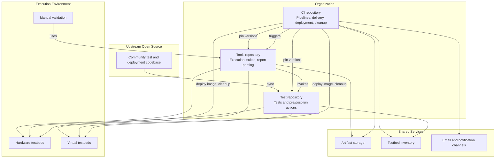

# SONiC Validation Organization — Abstract Repository Architecture

This document describes a three-repository model for validating SONiC on hardware and virtual testbeds, using community test frameworks, custom automation, CI, and manual end-to-end validation. It is intended for developers, test engineers, and management.

---

## 1. Purpose of the Split

SONiC validation spans several concerns that change at different rates and are owned by different teams:

- **Test content** — what to verify, how to interact with devices, and what happens immediately before and after a test run on the testbed
- **Execution tooling** — how to run suites, interpret raw test output, and support manual runs
- **Orchestration** — when and where runs happen, image deployment, environment lifecycle, result delivery, and notifications

Keeping these in separate repositories reduces coupling, avoids duplicating runner logic between CI and manual workflows, and makes upstream synchronization manageable.

---

## 2. High-Level Architecture

```mermaid
flowchart TB
    subgraph upstream [Upstream Open Source]
        UP[Community test and deployment codebase]
    end

    subgraph org [Organization]
        R1[Test repository<br/>Tests and pre/post-run actions]
        R2[Tools repository<br/>Execution, suites, report parsing]
        R3[CI repository<br/>Pipelines, delivery, deployment, cleanup]
    end

    subgraph runtime [Execution Environment]
        HW[Hardware testbeds]
        VS[Virtual testbeds]
        MAN[Manual validation]
    end

    subgraph data [Shared Services]
        ART[Artifact storage]
        INV[Testbed inventory]
        NOTIFY[Email and notification channels]
    end

    UP -->|sync| R1
    R3 -->|pin versions| R1
    R3 -->|pin versions| R2
    R2 -->|invokes| R1
    R3 -->|triggers| R2
    MAN -->|uses| R2
    R2 --> HW
    R2 --> VS
    R1 --> HW
    R1 --> VS
    R3 -->|deploy image, cleanup| HW
    R3 -->|deploy image, cleanup| VS
    R2 --> ART
    R3 --> ART
    R3 --> NOTIFY
    R3 --> INV
    R1 --> INV
```

---

## 3. The Three Repositories

### 3.1 Test Repository (Synced Fork + Custom Tests)

**Role:** Source of truth for *what* is tested, *how tests interact with SONiC testbeds*, and *what actions run around each test execution*.

**Contains:**

- Automated test cases (community framework tests and organization-specific tests)
- Shared test infrastructure: fixtures, plugins, helpers, markers, skip conditions
- Testbed deployment and device interaction logic used during tests
- **Pre- and post-run action scripts**, such as:
  - Sanity checks before or after a test run
  - Log collection and diagnostic capture
  - Testbed state verification or recovery steps tied to test execution
- Test plans and technical documentation for validation scope
- Definitions that describe testbed topology and device roles (without secrets)

**Does not contain:**

- CI pipeline definitions
- Generic test execution entry points used by both automation and manual workflows
- Test suite composition definitions
- Result delivery or notification logic
- Credentials or environment-specific secrets

**Relationship to upstream:**

- Maintained as a fork or mirror of the community project
- Periodically synchronized via merge or cherry-pick
- Organization-specific tests live in clearly separated areas so upstream merges stay predictable
- Long-lived stabilization branches may exist for specific product or SONiC release lines

**Primary consumers:** Test developers, feature developers contributing test fixes, release owners reviewing coverage.

---

### 3.2 Tools Repository (Execution, Suites, Report Parsing)

**Role:** Shared execution layer for both automated CI runs and manual validation. Defines *how* suites are run and *how raw test output is interpreted*.

**Contains:**

- **Scripts for test execution** that invoke the test repository's frameworks with consistent parameters
- **Test suite definitions** (smoke, nightly, regression, release gate, and similar)
- Testbed profiles that map abstract testbed names to inventory the test repository expects
- **Test report parsers** that process standardized test output (for example JUnit XML) into structured results
- Manual E2E support helpers (checklists, session recording, structured pass/fail capture)

**Does not contain:**

- Individual test assertions or feature-specific test logic
- Pre- and post-run sanity or log-collection scripts tied to test content (those belong in the test repository)
- Jenkins or other CI pipeline definitions
- Email delivery, image deployment, or environment cleanup logic

**Key design rule:** CI and manual testers call the same tools to run suites. Pipelines should orchestrate infrastructure tasks; they should not reimplement how tests are launched or how suites are defined.

**Primary consumers:** Test operations, automation engineers, manual testers, CI system (indirectly).

---

### 3.3 CI Repository (Pipelines, Delivery, Deployment, Cleanup)

**Role:** Defines *when*, *on which infrastructure*, and *under which constraints* validation runs, and handles post-run operational tasks outside test execution itself.

**Contains:**

- **Jenkins pipelines** and shared pipeline libraries
- Job parameters (suite name, testbed pool, image version, test repository revision, tools version)
- Agent or worker configuration and capability labels
- Testbed pool assignment and locking or reservation logic
- **Image deployment** scripts and pipeline stages
- **Environment clean-up** scripts and pipeline stages
- **Scripts for test results collection, parsing, and delivery** (for example email summaries, artifact archival, integration with notification channels)
- References to secrets (not the secrets themselves)
- Operational jobs: testbed recovery, scheduled upstream sync, image validation triggers
- Documentation of the pipeline catalog for non-technical stakeholders

**Does not contain:**

- Test cases or test assertions
- Test suite definitions or test execution scripts (those belong in the tools repository)
- Pre- and post-run testbed actions tied to test content (those belong in the test repository)

**Key design rule:** A pipeline prepares the environment, deploys images, invokes the tools repository to run tests, then collects and delivers results, and cleans up. Test execution semantics live in the tools and test repositories.

**Primary consumers:** DevOps and platform engineers, test leads defining gates, release managers tracking scheduled runs.

---

## 4. Dependencies Between Repositories

| From | To | Dependency type |
|------|----|-----------------|
| Test repository | Upstream community project | Periodic sync; upstream is authoritative for shared tests and core infrastructure |
| Tools repository | Test repository | Runtime checkout at pinned branch or commit; invokes tests and pre/post-run scripts |
| CI repository | Tools repository | Every automated run uses tools as the test execution entry point |
| CI repository | Test repository | Indirect — revision passed through tools; CI may also pin the test repository version explicitly |
| CI repository | Shared services | Artifact storage, credentials vault, testbed inventory, email and notification channels |
| All execution paths | Shared services | Artifact storage, credentials vault, testbed inventory |

**Version pinning:** For each product or SONiC release line, the organization should maintain an explicit compatibility matrix linking test repository revision, tools version, default suites, and expected image builds. CI parameters and suite definitions should reference this matrix rather than ad hoc floating versions.

---

## 5. Data and Control Flows

### Automated regression (CI)

1. CI pipeline starts on schedule or trigger.
2. Pipeline reserves a testbed (if hardware) and resolves parameters.
3. Pipeline deploys the target SONiC image to the testbed.
4. Pipeline invokes the tools repository with suite name, testbed profile, and pinned test repository revision.
5. Tools repository checks out the test repository and runs the suite.
6. Test repository executes pre-run actions (sanity checks), runs tests, then post-run actions (log collection, diagnostics).
7. Tools repository parses raw test output into structured results.
8. CI pipeline collects artifacts and parsed results, delivers summaries via email or other notification channels, and archives outputs.
9. Pipeline performs environment clean-up and releases the testbed.

### Pull-request or pre-merge validation

Same flow as automated regression, but with a narrower suite, shorter timeout, and typically virtual testbeds. Purpose is to guard changes to the test repository or execution tooling before they enter nightly or release pipelines.

### Manual E2E validation

1. Tester invokes the tools repository with a chosen suite and testbed profile.
2. Test repository runs pre/post actions and tests as defined for that suite.
3. Tools repository parses output and presents results locally.
4. Tester records any additional manual observations outside the automated flow if needed.

### Upstream synchronization

1. Scheduled or on-demand job merges upstream changes into the organization's test repository branch.
2. Smoke validation runs on virtual testbeds via the tools and CI pipeline.
3. Conflicts in organization-specific test areas are resolved by test owners.
4. After merge, pinned revisions in CI and suite definitions are updated deliberately — not automatically without review.

---

## 6. Design Principles

**Separation of content and orchestration.** Tests and test-adjacent actions (sanity, log collection) live with test content; CI handles scheduling, deployment, delivery, and cleanup. Mixing these causes merge pain during upstream sync and makes manual reproduction of CI runs harder.

**One execution path.** Whether triggered by Jenkins or an engineer at a terminal, the same tools layer runs the same suite definition against the same test repository revision. Divergence between CI scripts and manual scripts is a common source of false confidence.

**Clear split between parsing and delivery.** The tools repository parses test output into a structured form usable by both humans and automation. The CI repository owns collection, archival, and delivery (email, notifications) after a run completes.

**Upstream-friendly customization.** Organization-specific tests and configuration should be isolated so community merges remain routine. The organization should be able to contribute fixes upstream without exporting internal pipeline or tooling code.

**Inventory and secrets outside git.** Testbed credentials, SSH keys, and API tokens live in a secrets manager. Repositories hold names, capabilities, and templates — not production secrets.

**Traceability.** Every run should record enough metadata to reproduce it: test repository revision, tools version, image build, testbed identity, triggering user or job, and timestamps.

---

## 7. Summary

| Repository (abstract) | Answers the question |
|-----------------------|----------------------|
| **Test** | *What* do we validate, *how* do tests interact with testbeds, and *what pre/post actions* surround each run? |
| **Tools** | *How* do we execute suites, define suite composition, and parse test reports — for CI and manual use? |
| **CI** | *When and where* do runs happen, *how* are images deployed and environments cleaned up, and *how* are results collected and delivered? |

Together, these three repositories form a layered architecture: test content and test-adjacent actions (test), execution and interpretation (tools), and scheduling plus operational lifecycle (CI). Each layer has a narrow contract with the next, which keeps upstream synchronization practical and makes both automated and manual validation reproducible across the organization.
